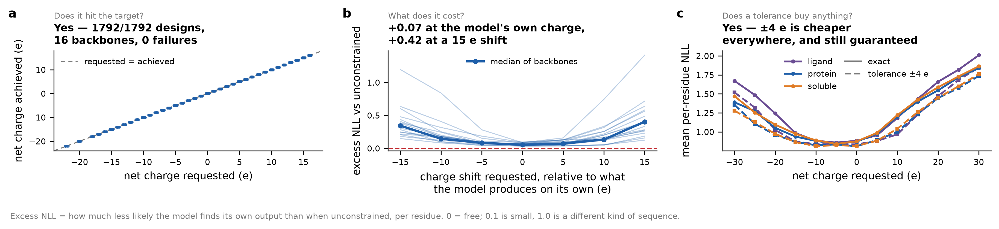
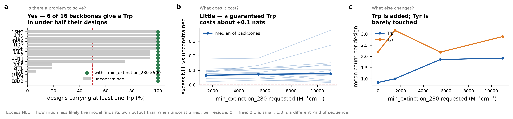
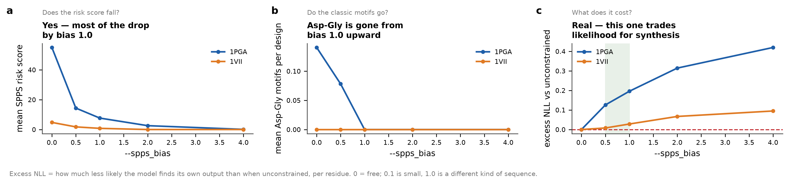

## LigandMPNN

This package provides inference code for [LigandMPNN](https://www.biorxiv.org/content/10.1101/2023.12.22.573103v1) & [ProteinMPNN](https://www.science.org/doi/10.1126/science.add2187) models. The code and model parameters are available under the MIT license.

Third party code: side chain packing uses helper functions from [Openfold](https://github.com/aqlaboratory/openfold).

---

## Constrained decoding: charge, A280 detectability, SPPS friendliness

This fork adds three deterministic constraints that are applied **while the
model decodes**, so a design can be required to have a given net charge, to
carry a 280 nm chromophore, or to avoid known solid-phase-peptide-synthesis
failure motifs.

No weights are retrained and no checkpoint is modified. At each autoregressive
step MPNN emits 21 amino-acid logits; a deterministic layer re-weights and
prunes them before sampling. Two of the three constraints are therefore not
biases but **guarantees**, verified on every sampled design.

| Flag | What it does | Guarantee |
|---|---|---|
| `--target_charge -4` | Net charge of the designed sequence | **Exact** (1248/1248 designs across 3 models and 13 targets) |
| `--min_extinction_280 5500` | Molar extinction coefficient at 280 nm | **Lower bound always met** (192/192 designs) |
| `--spps_bias 1.0` | Penalises Fmoc-SPPS risk motifs | **None** — steering only; see below |

```bash
# A ubiquitin redesign that must carry exactly -8 net charge
python run.py --model_type soluble_mpnn \
    --checkpoint_soluble_mpnn ./model_params/solublempnn_v_48_020.pt \
    --pdb_path ./benchmarks/structures/1UBQ.pdb --out_folder ./outputs/charge \
    --batch_size 8 --target_charge -8

# A peptide guaranteed to have at least one Trp, so A280 can quantify it
python run.py --model_type soluble_mpnn \
    --checkpoint_soluble_mpnn ./model_params/solublempnn_v_48_020.pt \
    --pdb_path ./benchmarks/structures/1VII.pdb --out_folder ./outputs/uv \
    --batch_size 8 --min_extinction_280 5500

# All three at once
python run.py --model_type ligand_mpnn \
    --checkpoint_ligand_mpnn ./model_params/ligandmpnn_v_32_010_25.pt \
    --pdb_path ./inputs/1BC8.pdb --out_folder ./outputs/combined \
    --batch_size 8 --target_charge 4 --min_extinction_280 5500 --spps_bias 1.0
```

With any constraint active, or with `--report_properties 1`, the measured
values are written into the FASTA header so baselines are directly comparable:

```
>1UBQ, id=1, T=0.1, seed=5, overall_confidence=0.2884, ligand_confidence=0.2884,
 seq_rec=0.4342, net_charge=-8, e280=11000, spps_risk=12.40
```

### How it works

Charge and extinction coefficient are both **linear functionals of
composition**: `f(seq) = Σ v[seq_i]`. That shared structure means one
controller handles both, in two stages per decoding step.

1. **Soft steering.** A multiplier `λ` is found by bisection so the expected
   value contributed by this step matches the per-position requirement implied
   by what is still outstanding. This spreads the requirement over the whole
   chain instead of dumping it on whichever positions happen to decode last.
   `E_λ[v]` is strictly increasing in `λ`, so the bisection is unconditionally
   safe.
2. **Hard reachability pruning.** Any amino acid whose selection would make
   the target unreachable by the positions not yet decoded is masked out. The
   reachable interval is precomputed as a suffix sum over each batch row's own
   decoding order, accounting for fixed residues and per-position omissions.

Stage 2 is what turns "approximately the requested charge" into "exactly the
requested charge". Stage 1 is what keeps the sequence sensible while doing so.

SPPS risk is **not** a linear functional — Asp-Gly and β-branched runs depend
on sequence neighbours. Because MPNN decodes in a random order, some
neighbours of the position being decided do not exist yet, so the penalty sees
partial context and acts greedily. Hence: no guarantee.

The accurate name for this is **constrained decoding**. It is the protein-design
analogue of constrained text generation — "NeuroLogic Decoding: (Un)supervised
Neural Text Generation with Predicate Logic Constraints" and its successor
["NeuroLogic A*esque Decoding: Constrained Text Generation with Lookahead
Heuristics"](https://aclanthology.org/2022.naacl-main.57/) (Lu et al., NAACL
2022), where lookahead estimates of future constraint satisfaction guide an
autoregressive decoder. Applying constrained decoding to ProteinMPNN is not
new either: ["A novel decoding strategy for ProteinMPNN to design with less
visibility to cytotoxic T-lymphocytes"](https://doi.org/10.1016/j.csbj.2025.07.055)
(Computational and Structural Biotechnology Journal, 2025) steers designs away
from peptides predicted to be presented by MHC class I. What is added here is
the constraint set and the exactness.

### Non-destructive by construction

The hook is gated on `feature_dict.get("constraints")`, so with no new flags
the original arithmetic runs untouched. This is verified rather than asserted:

```
bash tests/test_identical_to_upstream.sh
```

runs every model type at a fixed seed from both the base revision and the
working tree and compares the FASTA output byte for byte.

```
IDENTICAL  protein_mpnn 1BC8                    IDENTICAL  protein_mpnn 2GFB
IDENTICAL  soluble_mpnn 1BC8                    IDENTICAL  soluble_mpnn 2GFB
IDENTICAL  ligand_mpnn 1BC8                     IDENTICAL  ligand_mpnn 2GFB
IDENTICAL  global_label_membrane_mpnn 1BC8      IDENTICAL  global_label_membrane_mpnn 2GFB
IDENTICAL  per_residue_label_membrane_mpnn 1BC8 IDENTICAL  per_residue_label_membrane_mpnn 2GFB
```

`sample()` is one method shared by every model type, so the constraints work
with `protein_mpnn`, `soluble_mpnn`, `ligand_mpnn` and both membrane variants
without per-model code. They compose with `--fixed_residues`,
`--redesigned_residues`, `--omit_AA`, `--bias_AA`, `--symmetry_residues` and
the existing per-residue JSON options. `log_probs` is still computed from the
raw logits, so `overall_confidence` stays comparable to unconstrained runs.

Unit tests: `python tests/test_constraints.py` (14 tests).

### Exact definitions

Read these before quoting a number; each quantity is a specific convention,
not a measurement.

**Net charge** counts Asp and Glu as −1, Lys and Arg as +1. His is treated as
**neutral** — its side-chain pKa near 6.0 leaves it roughly 10 % protonated at
pH 7.4, and a fractional value would forfeit the exact-integer guarantee. Free
α-amino and α-carboxyl termini are **not** counted; for a single chain they
cancel. This is a design-time convention, not a predicted titration curve.

**ε₂₈₀** is `5500·n_Trp + 1490·n_Tyr` M⁻¹cm⁻¹, from [Pace et al., Protein Sci
4:2411 (1995)](https://doi.org/10.1002/pro.5560041120), for a protein with all
cysteines **reduced**. Each cystine disulfide adds ≈125 M⁻¹cm⁻¹; disulfide
connectivity is not a function of sequence alone, so it is excluded and the
reported value is a lower bound for an oxidised protein. The flag guarantees an
extinction coefficient, **not** an absorbance — absorbance additionally depends
on concentration and path length. Useful values: `1490` = at least one Tyr,
`5500` = at least one Trp, `11000` = two Trp equivalents.

**Scope** (`--constraint_scope`) decides which residues a property is computed
over. The default `designed_chains` uses every residue of any chain containing
a designable position, so fixed native residues count toward the target — which
is what "this protein should have net charge −4" normally means.
`designed_positions` uses only the redesigned positions. If a target is
unreachable given the fixed residues, the run fails immediately with the
achievable range rather than silently missing:

```
constraints.InfeasibleConstraint: net_charge: target -3 e is not reachable.
Given the fixed residues and the allowed alphabet, the achievable range is [-2, 2] e.
```

**SPPS risk** is a dimensionless ranking heuristic, not a predicted synthesis
yield. It sums the well-documented Fmoc-SPPS failure modes — Asp-Gly and weaker
aspartimide-prone Asp-X motifs, β-branched Ile/Val/Thr adjacency and runs,
sliding-window aliphatic load, Cys and Met counts. **The weights are
hyperparameters chosen to rank these modes in a sensible order; they are not
measured effect sizes from the literature.** They live in one dict
(`SPPS_DEFAULT_WEIGHTS` in `constraints.py`) so you can retune them for your
chemistry. Two rules were deliberately left out: penalising Arg in favour of
Lys, because Arg(Pbf) has been reported to *reduce* resin-bound aggregation
where Lys(Boc) increases it; and rewarding Pro, because poly-Pro did not
reliably suppress on-resin aggregation.

### What is not claimed

- **No structural validation.** Nothing here was folded, and no design was
  expressed, synthesised or measured. The composition and sequence metrics
  shown here demonstrate what residues the constraint changes, not whether a
  design folds. A self-consistency check (fold the designs, measure RMSD to the
  input backbone) is the obvious next step and has not been done.
- **The charge convention is not a pI or a titration model.** If you need pI or
  pH-dependent charge, compute it from the output sequence with a proper tool.
- **The SPPS term is untested against real synthesis.** It encodes literature
  failure modes; it does not predict whether a peptide will actually couple.
- **Joint hard constraints can compete.** Reachability is computed per
  constraint, not jointly, so an exact charge target combined with a high
  extinction floor on a very short peptide could in principle over-restrict a
  position. `run.py` verifies every sampled design against every hard
  constraint and prints a warning if any missed; no violation was observed in
  any benchmark run.
- **Discrete reachability matters for equality constraints.** Integer-valued
  equality targets, including tied symmetry groups and omitted residues, are
  checked against their discrete reachable set. If a target is impossible, the
  run raises an `InfeasibleConstraint` with the reachable interval rather than
  silently returning a miss. Non-integer equality functionals still use the
  interval fallback.

### Benchmarks

Reproduce with:

```bash
python benchmarks/fetch_panel.py       # downloads the panel only when missing
python benchmarks/bench_charge.py       # charge sweep plus 0/+-4 tolerance arms
python benchmarks/bench_extinction.py   # ~3 min
python benchmarks/bench_spps.py         # ~8 min
python benchmarks/make_figures.py       # needs pandas + matplotlib only
```

Each benchmark shells out to `run.py` exactly as a user would and parses the
FASTA headers, so the numbers are the numbers the CLI produces. Raw per-design
results are in `benchmarks/results/*.csv`.

#### 1. Charge, on ubiquitin (1UBQ, 76 aa, whole chain redesigned)



Sweeping the target from −30 to +30 across `protein_mpnn`, `soluble_mpnn` and
`ligand_mpnn`, 32 designs each: **1248/1248 designs hit the requested charge
exactly.** Left to itself the model produces about −5 e on this backbone
(native ubiquitin is 0 e), so most of this range is a long way from what it
would choose.

The composition panel uses target −5 e, near the unconstrained mean. The
requested shift is visible primarily in D/E/K/R, while the other residues move
less. The tolerance panel reports the mean absolute frequency change separately
for D/E/K/R and the other 16 residues, rather than treating MPNN's own NLL as a
biophysical quality score.

#### 2. ε₂₈₀, on the villin headpiece (1VII, 36 aa, SolubleMPNN)



The updated benchmark uses four backbones, three model types, and 50 designs
per threshold. The composition comparison uses 1VII with SolubleMPNN. Native
HP36 has exactly one Trp, but unconstrained designs can be low in ε₂₈₀; a set
without a chromophore cannot be quantified by A280.

The swarm shows the final ε₂₈₀ values for requests off, 0, 1000, 2000, 4000,
8000 and 16000. Every constrained design meets its requested floor. The
composition panel shows that the largest change is the required Trp/Tyr usage;
the other residues move much less on the selected 1VII comparison. This is a
sequence-level composition result, not evidence that the designs fold.

#### 3. SPPS risk, on two targets



1VII (36 aa) is comfortably in routine Fmoc-SPPS range, and its designs contain
**no Asp-Gly at all** — so on this target the score is driven almost entirely
by β-branched load, which falls from 4.77 to 0.00 as the bias goes 0 → 2.
Reporting that honestly matters: the headline aspartimide rule has nothing to
do here.

1PGA (the B1 domain of protein G, 56 aa, sampled at T=0.3) is the target where
aspartimide motifs actually appear. Asp-Gly is present in 14.1 % of
unconstrained designs, 7.8 % at bias 0.5, and **0 % from bias 1.0 upward**;
β-branched residues fall from 17.7 to 7.0 per design at bias 1.0.

The composition panel makes the trade-off explicit without using model NLL.
GB1's native sequence scores 54.2 on this risk scale — essentially the same as
the unconstrained designs — because its β-sheet core genuinely is
β-branched-rich. Driving the risk to zero means removing the residues that
build that sheet. `--spps_bias` is a dial on a real trade-off, not a free
improvement; 0.5–1.0 is where it removes the classic motifs while keeping the
composition shift smaller than at extreme bias.

---

### Running the code
```
git clone https://github.com/dauparas/LigandMPNN.git
cd LigandMPNN
bash get_model_params.sh "./model_params"

#setup your conda/or other environment
#conda create -n ligandmpnn_env python=3.11
#pip3 install -r requirements.txt

python run.py \
        --seed 111 \
        --pdb_path "./inputs/1BC8.pdb" \
        --out_folder "./outputs/default"
```

### Dependencies
To run the model you will need to have Python>=3.0, PyTorch, Numpy installed, and to read/write PDB files you will need [Prody](https://pypi.org/project/ProDy/).

For example to make a new conda environment for LigandMPNN run:
```
conda create -n ligandmpnn_env python=3.11
pip3 install -r requirements.txt
```

### Main differences compared with [ProteinMPNN](https://github.com/dauparas/ProteinMPNN) code
- Input PDBs are parsed using [Prody](https://pypi.org/project/ProDy/) preserving protein residue indices, chain letters, and insertion codes. If there are missing residues in the input structure the output fasta file won't have added `X` to fill the gaps. The script outputs .fasta and .pdb files. It's recommended to use .pdb files since they will hold information about chain letters and residue indices.
- Adding bias, fixing residues, and selecting residues to be redesigned now can be done using residue indices directly, e.g. A23 (means chain A residue with index 23), B42D (chain B, residue 42, insertion code D).
- Model writes to fasta files: `overall_confidence`, `ligand_confidence` which reflect the average confidence/probability (with T=1.0) over the redesigned residues  `overall_confidence=exp[-mean_over_residues(log_probs)]`. Higher numbers mean the model is more confident about that sequence. min_value=0.0; max_value=1.0. Sequence recovery with respect to the input sequence is calculated only over the redesigned residues.

### Model parameters
To download model parameters run:
```
bash get_model_params.sh "./model_params"
```

### Available models

To run the model of your choice specify `--model_type` and optionally the model checkpoint path. Available models:
- ProteinMPNN
```
--model_type "protein_mpnn"
--checkpoint_protein_mpnn "./model_params/proteinmpnn_v_48_002.pt" #noised with 0.02A Gaussian noise
--checkpoint_protein_mpnn "./model_params/proteinmpnn_v_48_010.pt" #noised with 0.10A Gaussian noise
--checkpoint_protein_mpnn "./model_params/proteinmpnn_v_48_020.pt" #noised with 0.20A Gaussian noise
--checkpoint_protein_mpnn "./model_params/proteinmpnn_v_48_030.pt" #noised with 0.30A Gaussian noise
```
- LigandMPNN
```
--model_type "ligand_mpnn"
--checkpoint_ligand_mpnn "./model_params/ligandmpnn_v_32_005_25.pt" #noised with 0.05A Gaussian noise
--checkpoint_ligand_mpnn "./model_params/ligandmpnn_v_32_010_25.pt" #noised with 0.10A Gaussian noise
--checkpoint_ligand_mpnn "./model_params/ligandmpnn_v_32_020_25.pt" #noised with 0.20A Gaussian noise
--checkpoint_ligand_mpnn "./model_params/ligandmpnn_v_32_030_25.pt" #noised with 0.30A Gaussian noise
```
- SolubleMPNN
```
--model_type "soluble_mpnn"
--checkpoint_soluble_mpnn "./model_params/solublempnn_v_48_002.pt" #noised with 0.02A Gaussian noise
--checkpoint_soluble_mpnn "./model_params/solublempnn_v_48_010.pt" #noised with 0.10A Gaussian noise
--checkpoint_soluble_mpnn "./model_params/solublempnn_v_48_020.pt" #noised with 0.20A Gaussian noise
--checkpoint_soluble_mpnn "./model_params/solublempnn_v_48_030.pt" #noised with 0.30A Gaussian noise
```
- ProteinMPNN with global membrane label
```
--model_type "global_label_membrane_mpnn"
--checkpoint_global_label_membrane_mpnn "./model_params/global_label_membrane_mpnn_v_48_020.pt" #noised with 0.20A Gaussian noise
```
- ProteinMPNN with per residue membrane label
```
--model_type "per_residue_label_membrane_mpnn"
--checkpoint_per_residue_label_membrane_mpnn "./model_params/per_residue_label_membrane_mpnn_v_48_020.pt" #noised with 0.20A Gaussian noise
```
- Side chain packing model
```
--checkpoint_path_sc "./model_params/ligandmpnn_sc_v_32_002_16.pt"
```
## Design examples
### 1 default
Default settings will run ProteinMPNN.
```
python run.py \
        --seed 111 \
        --pdb_path "./inputs/1BC8.pdb" \
        --out_folder "./outputs/default"
```
### 2 --temperature
`--temperature 0.05` Change sampling temperature (higher temperature gives more sequence diversity).
```
python run.py \
        --seed 111 \
        --pdb_path "./inputs/1BC8.pdb" \
        --temperature 0.05 \
        --out_folder "./outputs/temperature"
```
### 3 --seed
`--seed` Not selecting a seed will run with a random seed. Running this multiple times will give different results.
```
python run.py \
        --pdb_path "./inputs/1BC8.pdb" \
        --out_folder "./outputs/random_seed"
```
### 4 --verbose
`--verbose 0` Do not print any statements.
```
python run.py \
        --seed 111 \
        --verbose 0 \
        --pdb_path "./inputs/1BC8.pdb" \
        --out_folder "./outputs/verbose"
```
### 5 --save_stats
`--save_stats 1` Save sequence design statistics.
```
#['generated_sequences', 'sampling_probs', 'log_probs', 'decoding_order', 'native_sequence', 'mask', 'chain_mask', 'seed', 'temperature']
python run.py \
        --seed 111 \
        --pdb_path "./inputs/1BC8.pdb" \
        --out_folder "./outputs/save_stats" \
        --save_stats 1
```
### 6 --fixed_residues
`--fixed_residues` Fixing specific amino acids. This example fixes the first 10 residues in chain C and adds global bias towards A (alanine). The output should have all alanines except the first 10 residues should be the same as in the input sequence since those are fixed.
```
python run.py \
        --seed 111 \
        --pdb_path "./inputs/1BC8.pdb" \
        --out_folder "./outputs/fix_residues" \
        --fixed_residues "C1 C2 C3 C4 C5 C6 C7 C8 C9 C10" \
        --bias_AA "A:10.0"
```

### 7 --redesigned_residues
`--redesigned_residues` Specifying which residues need to be designed. This example redesigns the first 10 residues while fixing everything else.
```
python run.py \
        --seed 111 \
        --pdb_path "./inputs/1BC8.pdb" \
        --out_folder "./outputs/redesign_residues" \
        --redesigned_residues "C1 C2 C3 C4 C5 C6 C7 C8 C9 C10" \
        --bias_AA "A:10.0"
```

### 8 --number_of_batches
Design 15 sequences; with batch size 3 (can be 1 when using CPUs) and the number of batches 5.
```
python run.py \
        --seed 111 \
        --pdb_path "./inputs/1BC8.pdb" \
        --out_folder "./outputs/batch_size" \
        --batch_size 3 \
        --number_of_batches 5
```
### 9 --bias_AA
Global amino acid bias. In this example, output sequences are biased towards W, P, C and away from A.
```
python run.py \
        --seed 111 \
        --pdb_path "./inputs/1BC8.pdb" \
        --bias_AA "W:3.0,P:3.0,C:3.0,A:-3.0" \
        --out_folder "./outputs/global_bias"
```
### 10 --bias_AA_per_residue
Specify per residue amino acid bias, e.g. make residues C1, C3, C5, and C7 to be prolines.
```
# {
# "C1": {"G": -0.3, "C": -2.0, "P": 10.8},
# "C3": {"P": 10.0},
# "C5": {"G": -1.3, "P": 10.0},
# "C7": {"G": -1.3, "P": 10.0}
# }
python run.py \
        --seed 111 \
        --pdb_path "./inputs/1BC8.pdb" \
        --bias_AA_per_residue "./inputs/bias_AA_per_residue.json" \
        --out_folder "./outputs/per_residue_bias"
```
### 11 --omit_AA
Global amino acid restrictions. This is equivalent to using `--bias_AA` and setting bias to be a large negative number. The output should be just made of E, K, A.
```
python run.py \
        --seed 111 \
        --pdb_path "./inputs/1BC8.pdb" \
        --omit_AA "CDFGHILMNPQRSTVWY" \
        --out_folder "./outputs/global_omit"
```

### 12 --omit_AA_per_residue
Per residue amino acid restrictions.
```
# {
# "C1": "ACDEFGHIKLMNPQRSTVW",
# "C3": "ACDEFGHIKLMNPQRSTVW",
# "C5": "ACDEFGHIKLMNPQRSTVW",
# "C7": "ACDEFGHIKLMNPQRSTVW"
# }
python run.py \
        --seed 111 \
        --pdb_path "./inputs/1BC8.pdb" \
        --omit_AA_per_residue "./inputs/omit_AA_per_residue.json" \
        --out_folder "./outputs/per_residue_omit"
```
### 13 --symmetry_residues
### 13 --symmetry_weights
Designing sequences with symmetry, e.g. homooligomer/2-state proteins, etc. In this example make C1=C2=C3, also C4=C5, and C6=C7.
```
#total_logits += symmetry_weights[t]*logits
#probs = torch.nn.functional.softmax((total_logits+bias_t) / temperature, dim=-1)
#total_logits_123 = 0.33*logits_1+0.33*logits_2+0.33*logits_3
#output should be ***ooxx
python run.py \
        --seed 111 \
        --pdb_path "./inputs/1BC8.pdb" \
        --out_folder "./outputs/symmetry" \
        --symmetry_residues "C1,C2,C3|C4,C5|C6,C7" \
        --symmetry_weights "0.33,0.33,0.33|0.5,0.5|0.5,0.5"
```


### 14 --homo_oligomer
Design homooligomer sequences. This automatically sets `--symmetry_residues` and `--symmetry_weights` assuming equal weighting from all chains.
```
python run.py \
        --model_type "ligand_mpnn" \
        --seed 111 \
        --pdb_path "./inputs/4GYT.pdb" \
        --out_folder "./outputs/homooligomer" \
        --homo_oligomer 1 \
        --number_of_batches 2
```

### 15 --file_ending
Outputs will have a specified ending; e.g. `1BC8_xyz.fa` instead of `1BC8.fa`
```
python run.py \
        --seed 111 \
        --pdb_path "./inputs/1BC8.pdb" \
        --out_folder "./outputs/file_ending" \
        --file_ending "_xyz"
```

### 16 --zero_indexed
Zero indexed names in /backbones/1BC8_0.pdb, 1BC8_1.pdb, 1BC8_2.pdb etc
```
python run.py \
        --seed 111 \
        --pdb_path "./inputs/1BC8.pdb" \
        --out_folder "./outputs/zero_indexed" \
        --zero_indexed 1 \
        --number_of_batches 2
```

### 17 --chains_to_design
Specify which chains (e.g. "A,B,C") need to be redesigned, other chains will be kept fixed. Outputs in seqs/backbones will still have atoms/sequences for the whole input PDB.
```
python run.py \
        --model_type "ligand_mpnn" \
        --seed 111 \
        --pdb_path "./inputs/4GYT.pdb" \
        --out_folder "./outputs/chains_to_design" \
        --chains_to_design "A,B"
```
### 18 --parse_these_chains_only
Parse and design only specified chains (e.g. "A,B,C"). Outputs will have only specified chains.
```
python run.py \
        --model_type "ligand_mpnn" \
        --seed 111 \
        --pdb_path "./inputs/4GYT.pdb" \
        --out_folder "./outputs/parse_these_chains_only" \
        --parse_these_chains_only "A,B"
```

### 19 --model_type "ligand_mpnn"
Run LigandMPNN with default settings.
```
python run.py \
        --model_type "ligand_mpnn" \
        --seed 111 \
        --pdb_path "./inputs/1BC8.pdb" \
        --out_folder "./outputs/ligandmpnn_default"
```

### 20 --checkpoint_ligand_mpnn
Run LigandMPNN using 0.05A model by specifying `--checkpoint_ligand_mpnn` flag.
```
python run.py \
        --checkpoint_ligand_mpnn "./model_params/ligandmpnn_v_32_005_25.pt" \
        --model_type "ligand_mpnn" \
        --seed 111 \
        --pdb_path "./inputs/1BC8.pdb" \
        --out_folder "./outputs/ligandmpnn_v_32_005_25"
```
### 21 --ligand_mpnn_use_atom_context
Setting `--ligand_mpnn_use_atom_context 0` will mask all ligand atoms. This can be used to assess how much ligand atoms affect AA probabilities. 
```
python run.py \
        --model_type "ligand_mpnn" \
        --seed 111 \
        --pdb_path "./inputs/1BC8.pdb" \
        --out_folder "./outputs/ligandmpnn_no_context" \
        --ligand_mpnn_use_atom_context 0
```

### 22 --ligand_mpnn_use_side_chain_context
Use fixed residue side chain atoms as extra ligand atoms.
```
python run.py \
        --model_type "ligand_mpnn" \
        --seed 111 \
        --pdb_path "./inputs/1BC8.pdb" \
        --out_folder "./outputs/ligandmpnn_use_side_chain_atoms" \
        --ligand_mpnn_use_side_chain_context 1 \
        --fixed_residues "C1 C2 C3 C4 C5 C6 C7 C8 C9 C10"
```

### 23 --model_type "soluble_mpnn"
Run SolubleMPNN (ProteinMPNN-like model with only soluble proteins in the training dataset).
```
python run.py \
        --model_type "soluble_mpnn" \
        --seed 111 \
        --pdb_path "./inputs/1BC8.pdb" \
        --out_folder "./outputs/soluble_mpnn_default"
```

### 24 --model_type "global_label_membrane_mpnn"
Run global label membrane MPNN (trained with extra input - binary label soluble vs not) `--global_transmembrane_label #1 - membrane, 0 - soluble`. 
```
python run.py \
        --model_type "global_label_membrane_mpnn" \
        --seed 111 \
        --pdb_path "./inputs/1BC8.pdb" \
        --out_folder "./outputs/global_label_membrane_mpnn_0" \
        --global_transmembrane_label 0
```

### 25 --model_type "per_residue_label_membrane_mpnn"
Run per residue label membrane MPNN (trained with extra input per residue specifying buried (hydrophobic), interface (polar), or other type residues; 3 classes).
```
python run.py \
        --model_type "per_residue_label_membrane_mpnn" \
        --seed 111 \
        --pdb_path "./inputs/1BC8.pdb" \
        --out_folder "./outputs/per_residue_label_membrane_mpnn_default" \
        --transmembrane_buried "C1 C2 C3 C11" \
        --transmembrane_interface "C4 C5 C6 C22"
```

### 26 --fasta_seq_separation
Choose a symbol to put between different chains in fasta output format. It's recommended to PDB output format to deal with residue jumps and multiple chain parsing.
```
python run.py \
        --pdb_path "./inputs/1BC8.pdb" \
        --out_folder "./outputs/fasta_seq_separation" \
        --fasta_seq_separation ":"
```

### 27 --pdb_path_multi
Specify multiple PDB input paths. This is more efficient since the model needs to be loaded from the checkpoint once.
```
#{
#"./inputs/1BC8.pdb": "",
#"./inputs/4GYT.pdb": ""
#}
python run.py \
        --pdb_path_multi "./inputs/pdb_ids.json" \
        --out_folder "./outputs/pdb_path_multi" \
        --seed 111
```

### 28 --fixed_residues_multi
Specify fixed residues when using `--pdb_path_multi` flag.
```
#{
#"./inputs/1BC8.pdb": "C1 C2 C3 C4 C5 C10 C22",
#"./inputs/4GYT.pdb": "A7 A8 A9 A10 A11 A12 A13 B38"
#}
python run.py \
        --pdb_path_multi "./inputs/pdb_ids.json" \
        --fixed_residues_multi "./inputs/fix_residues_multi.json" \
        --out_folder "./outputs/fixed_residues_multi" \
        --seed 111
```

### 29 --redesigned_residues_multi
Specify which residues need to be redesigned when using `--pdb_path_multi` flag.
```
#{
#"./inputs/1BC8.pdb": "C1 C2 C3 C4 C5 C10",
#"./inputs/4GYT.pdb": "A7 A8 A9 A10 A12 A13 B38"
#}
python run.py \
        --pdb_path_multi "./inputs/pdb_ids.json" \
        --redesigned_residues_multi "./inputs/redesigned_residues_multi.json" \
        --out_folder "./outputs/redesigned_residues_multi" \
        --seed 111
```

### 30 --omit_AA_per_residue_multi
Specify which residues need to be omitted when using `--pdb_path_multi` flag.
```
#{
#"./inputs/1BC8.pdb": {"C1":"ACDEFGHILMNPQRSTVWY", "C2":"ACDEFGHILMNPQRSTVWY", "C3":"ACDEFGHILMNPQRSTVWY"},
#"./inputs/4GYT.pdb": {"A7":"ACDEFGHILMNPQRSTVWY", "A8":"ACDEFGHILMNPQRSTVWY"}
#}
python run.py \
        --pdb_path_multi "./inputs/pdb_ids.json" \
        --omit_AA_per_residue_multi "./inputs/omit_AA_per_residue_multi.json" \
        --out_folder "./outputs/omit_AA_per_residue_multi" \
        --seed 111
```

### 31 --bias_AA_per_residue_multi
Specify amino acid biases per residue when using `--pdb_path_multi` flag.
```
#{
#"./inputs/1BC8.pdb": {"C1":{"A":3.0, "P":-2.0}, "C2":{"W":10.0, "G":-0.43}},
#"./inputs/4GYT.pdb": {"A7":{"Y":5.0, "S":-2.0}, "A8":{"M":3.9, "G":-0.43}}
#}
python run.py \
        --pdb_path_multi "./inputs/pdb_ids.json" \
        --bias_AA_per_residue_multi "./inputs/bias_AA_per_residue_multi.json" \
        --out_folder "./outputs/bias_AA_per_residue_multi" \
        --seed 111
```

### 32 --ligand_mpnn_cutoff_for_score
This sets the cutoff distance in angstroms to select residues that are considered to be close to ligand atoms. This flag only affects the `num_ligand_res` and `ligand_confidence` in the output fasta files.
```
python run.py \
        --model_type "ligand_mpnn" \
        --seed 111 \
        --pdb_path "./inputs/1BC8.pdb" \
        --ligand_mpnn_cutoff_for_score "6.0" \
        --out_folder "./outputs/ligand_mpnn_cutoff_for_score"
```

### 33 specifying residues with insertion codes
You can specify residue using chain_id + residue_number + insersion_code; e.g. redesign only residue B82, B82A, B82B, B82C.
```
python run.py \
        --seed 111 \
        --pdb_path "./inputs/2GFB.pdb" \
        --out_folder "./outputs/insertion_code" \
        --redesigned_residues "B82 B82A B82B B82C" \
        --parse_these_chains_only "B"
```

### 34 parse atoms with zero occupancy
Parse atoms in the PDB files with zero occupancy too.
```
python run.py \
        --model_type "ligand_mpnn" \
        --seed 111 \
        --pdb_path "./inputs/1BC8.pdb" \
        --out_folder "./outputs/parse_atoms_with_zero_occupancy" \
        --parse_atoms_with_zero_occupancy 1
```

## Scoring examples
### Output dictionary
```
out_dict = {}
out_dict["logits"] - raw logits from the model
out_dict["probs"] - softmax(logits)
out_dict["log_probs"] - log_softmax(logits)
out_dict["decoding_order"] - decoding order used (logits will depend on the decoding order)
out_dict["native_sequence"] - parsed input sequence in integers
out_dict["mask"] - mask for missing residues (usually all ones)
out_dict["chain_mask"] - controls which residues are decoded first
out_dict["alphabet"] - amino acid alphabet used
out_dict["residue_names"] - dictionary to map integers to residue_names, e.g. {0: "C10", 1: "C11"}
out_dict["sequence"] - parsed input sequence in alphabet
out_dict["mean_of_probs"] - averaged over batch_size*number_of_batches probabilities, [protein_length, 21]
out_dict["std_of_probs"] - same as above, but std
```

### 1 autoregressive with sequence info
Get probabilities/scores for backbone-sequence pairs using autoregressive probabilities: p(AA_1|backbone), p(AA_2|backbone, AA_1) etc. These probabilities will depend on the decoding order, so it's recomended to set number_of_batches to at least 10.
```
python score.py \
        --model_type "ligand_mpnn" \
        --seed 111 \
        --autoregressive_score 1\
        --pdb_path "./outputs/ligandmpnn_default/backbones/1BC8_1.pdb" \
        --out_folder "./outputs/autoregressive_score_w_seq" \
        --use_sequence 1\
        --batch_size 1 \
        --number_of_batches 10
```
### 2 autoregressive with backbone info only
Get probabilities/scores for backbone using probabilities: p(AA_1|backbone), p(AA_2|backbone) etc. These probabilities will depend on the decoding order, so it's recomended to set number_of_batches to at least 10.
```
python score.py \
        --model_type "ligand_mpnn" \
        --seed 111 \
        --autoregressive_score 1\
        --pdb_path "./outputs/ligandmpnn_default/backbones/1BC8_1.pdb" \
        --out_folder "./outputs/autoregressive_score_wo_seq" \
        --use_sequence 0\
        --batch_size 1 \
        --number_of_batches 10
```
### 3 single amino acid score with sequence info
Get probabilities/scores for backbone-sequence pairs using single aa probabilities: p(AA_1|backbone, AA_{all except AA_1}), p(AA_2|backbone, AA_{all except AA_2}) etc. These probabilities will depend on the decoding order, so it's recomended to set number_of_batches to at least 10.
```
python score.py \
        --model_type "ligand_mpnn" \
        --seed 111 \
        --single_aa_score 1\
        --pdb_path "./outputs/ligandmpnn_default/backbones/1BC8_1.pdb" \
        --out_folder "./outputs/single_aa_score_w_seq" \
        --use_sequence 1\
        --batch_size 1 \
        --number_of_batches 10
```
### 4 single amino acid score with backbone info only
Get probabilities/scores for backbone-sequence pairs using single aa probabilities: p(AA_1|backbone), p(AA_2|backbone) etc. These probabilities will depend on the decoding order, so it's recomended to set number_of_batches to at least 10.
```
python score.py \
        --model_type "ligand_mpnn" \
        --seed 111 \
        --single_aa_score 1\
        --pdb_path "./outputs/ligandmpnn_default/backbones/1BC8_1.pdb" \
        --out_folder "./outputs/single_aa_score_wo_seq" \
        --use_sequence 0\
        --batch_size 1 \
        --number_of_batches 10
```

## Side chain packing examples

### 1 design a new sequence and pack side chains (return 1 side chain packing sample - fast)
Design a new sequence using any of the available models and also pack side chains of the new sequence. Return only a single solution for the side chain packing.
```
python run.py \
        --model_type "ligand_mpnn" \
        --seed 111 \
        --pdb_path "./inputs/1BC8.pdb" \
        --out_folder "./outputs/sc_default_fast" \
        --pack_side_chains 1 \
        --number_of_packs_per_design 0 \
        --pack_with_ligand_context 1
```
### 2 design a new sequence and pack side chains (return 4 side chain packing samples) 
Same as above, but returns 4 independent samples for side chains. b-factor shows log prob density per chi angle group.
```
python run.py \
        --model_type "ligand_mpnn" \
        --seed 111 \
        --pdb_path "./inputs/1BC8.pdb" \
        --out_folder "./outputs/sc_default" \
        --pack_side_chains 1 \
        --number_of_packs_per_design 4 \
        --pack_with_ligand_context 1
```

### 3 fix specific residues fors sequence design and packing 
This option will not repack side chains of the fixed residues, but use them as a context.
```
python run.py \
        --model_type "ligand_mpnn" \
        --seed 111 \
        --pdb_path "./inputs/1BC8.pdb" \
        --out_folder "./outputs/sc_fixed_residues" \
        --pack_side_chains 1 \
        --number_of_packs_per_design 4 \
        --pack_with_ligand_context 1 \
        --fixed_residues "C6 C7 C8 C9 C10 C11 C12 C13 C14 C15" \
        --repack_everything 0
```
### 4 fix specific residues for sequence design but repack everything 
This option will repacks all the residues.
```
python run.py \
        --model_type "ligand_mpnn" \
        --seed 111 \
        --pdb_path "./inputs/1BC8.pdb" \
        --out_folder "./outputs/sc_fixed_residues_full_repack" \
        --pack_side_chains 1 \
        --number_of_packs_per_design 4 \
        --pack_with_ligand_context 1 \
        --fixed_residues "C6 C7 C8 C9 C10 C11 C12 C13 C14 C15" \
        --repack_everything 1
```

### 5 design a new sequence using LigandMPNN but pack side chains without considering ligand/DNA etc atoms
You can run side chain packing without taking into account context atoms like DNA atoms. This most likely will results in side chain clashing with context atoms, but it might be interesting to see how model's uncertainty changes when ligand atoms are present vs not for side chain conformations.
```
python run.py \
        --model_type "ligand_mpnn" \
        --seed 111 \
        --pdb_path "./inputs/1BC8.pdb" \
        --out_folder "./outputs/sc_no_context" \
        --pack_side_chains 1 \
        --number_of_packs_per_design 4 \
        --pack_with_ligand_context 0
```

## Pack-Only Mode

### Overview
Pack-only mode allows you to provide custom sequences and pack side chains directly without running the sequence design step. This is useful for:
- Repacking experimentally validated sequences
- Testing different sequences on the same backbone
- Bypassing the expensive design step when sequences are already known

### Basic Usage

#### Single PDB with one chain
```bash
python run.py \
    --pack_only 1 \
    --pdb_path "./inputs/1BC8.pdb" \
    --input_sequences "./inputs/sequences.fasta" \
    --out_folder "./outputs/pack_only" \
    --number_of_packs_per_design 4 \
    --seed 42
```

#### Multi-chain complex
For multi-chain complexes, sequences are assigned to chains in **alphabetical order** (A→seq1, B→seq2, etc.).

```bash
# FASTA file with 2 sequences for chains A and B
python run.py \
    --pack_only 1 \
    --pdb_path "./inputs/complex.pdb" \
    --input_sequences "./inputs/sequences.fasta" \
    --out_folder "./outputs/pack_only_multichain" \
    --number_of_packs_per_design 4 \
    --pack_with_ligand_context 1
```

#### Batch processing multiple PDBs
```bash
# Create JSON mapping: {pdb_path: fasta_path}
cat > pdbs.json << 'EOF'
{
    "./inputs/protein1.pdb": "",
    "./inputs/protein2.pdb": ""
}
EOF

cat > sequences.json << 'EOF'
{
    "./inputs/protein1.pdb": "./seqs/protein1.fasta",
    "./inputs/protein2.pdb": "./seqs/protein2.fasta"
}
EOF

python run.py \
    --pack_only 1 \
    --pdb_path_multi pdbs.json \
    --input_sequences_multi sequences.json \
    --out_folder "./outputs/pack_only_batch" \
    --number_of_packs_per_design 4
```

### FASTA Format
Each sequence in the FASTA file corresponds to one chain (in alphabetical order):
```
>chain_A_description
MKLLGIDSTQVNNAALSPEAKQIIYEKGTKVWVEPKSC
>chain_B_description  
ADVNQLIDSLKPEQVAAIDEARK
```

### Important Notes
- Sequence count must match chain count in PDB (PDBs with mismatches are skipped with warning)
- Sequence length must match chain length in PDB (validated before packing)
- Only standard 20 amino acids are supported
- `--pack_only` is incompatible with `--fixed_residues` and `--redesigned_residues`
- Compatible with all existing packing options: `--pack_with_ligand_context`, `--number_of_packs_per_design`, `--sc_num_denoising_steps`, etc.

### Things to add
- Support for ProteinMPNN CA-only model.
- Examples for scoring sequences only.
- Side-chain packing scripts.
- TER 


### Citing this work
If you use the code, please cite:
```
@article{dauparas2023atomic,
  title={Atomic context-conditioned protein sequence design using LigandMPNN},
  author={Dauparas, Justas and Lee, Gyu Rie and Pecoraro, Robert and An, Linna and Anishchenko, Ivan and Glasscock, Cameron and Baker, David},
  journal={Biorxiv},
  pages={2023--12},
  year={2023},
  publisher={Cold Spring Harbor Laboratory}
}

@article{dauparas2022robust,
  title={Robust deep learning--based protein sequence design using ProteinMPNN},
  author={Dauparas, Justas and Anishchenko, Ivan and Bennett, Nathaniel and Bai, Hua and Ragotte, Robert J and Milles, Lukas F and Wicky, Basile IM and Courbet, Alexis and de Haas, Rob J and Bethel, Neville and others},
  journal={Science},
  volume={378},
  number={6615},  
  pages={49--56},
  year={2022},
  publisher={American Association for the Advancement of Science}
}
```
