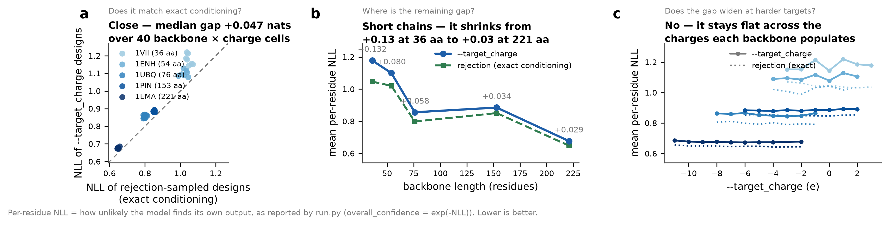

<!-- GENERATED FILE. Edit CONSTRAINED_DECODING.md.in and run
     python benchmarks/make_docs.py -->

# Constrained decoding: net charge, A280 detectability, SPPS friendliness

Three deterministic constraints applied **while the model decodes**, so a
design can be *required* to have a given net charge, to carry a 280 nm
chromophore, or to avoid known solid-phase peptide synthesis (SPPS) failure
motifs.

No weights are retrained and no checkpoint is modified. At each autoregressive
step MPNN emits 21 amino-acid logits; a deterministic layer re-weights and
prunes them before sampling. Two of the three are therefore not biases but
**guarantees**, checked on every sampled design.

---

## 1. What to use

| I want... | Flag | What you get | Typical cost |
|---|---|---|---|
| A specific net charge | `--target_charge -8` | Exactly that charge, every design | +0.06 nats near the model's own charge |
| Roughly that charge, cheaper | `--target_charge -8 --charge_tolerance 2` | Within ±2 e, every design | less than exact; see §5 |
| To quantify protein by A280 | `--min_extinction_280 5500` | At least one Trp, every design | +0.08 nats |
| An easier peptide to synthesise | `--spps_bias 1.0` | Fewer synthesis-risk motifs, **no guarantee** | depends on fold; see §7 |

All three work with every `--model_type` (`protein_mpnn`, `soluble_mpnn`,
`ligand_mpnn`, both membrane variants), because they hook the one `sample()`
method they all share.

```bash
# an acidic, A280-quantifiable design
python run.py --model_type soluble_mpnn \
    --checkpoint_soluble_mpnn ./model_params/solublempnn_v_48_020.pt \
    --pdb_path ./inputs/1BC8.pdb --out_folder ./out \
    --target_charge -8 --min_extinction_280 5500

# a peptide intended for the synthesiser
python run.py --model_type protein_mpnn \
    --checkpoint_protein_mpnn ./model_params/proteinmpnn_v_48_020.pt \
    --pdb_path ./inputs/1BC8.pdb --out_folder ./out --spps_bias 1.0
```

Measured properties are appended to each FASTA header whenever a constraint is
active, or on request with `--report_properties 1`.

---

## 2. What "cost" means here

Every cost in this document is **mean per-residue negative log-likelihood
(NLL)** under the model itself -- the quantity `run.py` already reports as
`overall_confidence = exp(-NLL)`. Lower means the model finds the sequence
more likely. A cost of +0.05 nats per residue means the constrained design is
modestly less typical of what the model would have produced unprompted.

This is a *model-internal* measure, not evidence about folding or expression.
Section 9 says what that does and does not license.

---

## 3. How it works

At decoding step *t* the network gives logits over 21 tokens. Two of the
constraints are **linear functionals of composition** -- net charge and the
extinction coefficient are both sums of per-residue values -- so they share
one controller with two stages.

**Lookahead reweighting.** The exact conditional is

```
p(s_t | s_<t, target)  =  p(s_t | s_<t) · P(target reachable | s_<=t) / Z
```

so the logits are multiplied by the probability that the positions *after*
this one can still supply whatever the target demands, estimated by a normal
approximation to that remaining sum. This constrains the **endpoint** and
nothing else.

An earlier version instead solved for a multiplier that forced each step's
*expected* contribution to match the outstanding per-position requirement.
That pins the whole **trajectory**, which is a far stronger condition than was
asked for, and section 8 shows it cost roughly ten times as much likelihood.

**Hard reachability pruning.** Any amino acid whose selection would make the
target unreachable from the positions not yet decoded is masked out. The
reachable interval is a suffix minimum/maximum along each batch row's own
decoding order, accounting for fixed residues, tied groups and `--omit_AA`.
This second stage is what makes the charge *exact* rather than approximate,
and it is untouched by the lookahead.

SPPS risk is **not** a linear functional -- it depends on which residues end
up next to each other -- so it is steered greedily on partial context and
carries no guarantee.

---

## 4. Is it non-destructive?

Yes, and it is tested rather than asserted. With no new flags the hook is
inert and the output is byte-identical to the base revision:

```bash
bash tests/test_identical_to_upstream.sh     # 10 identical, 0 differing
python tests/test_constraints.py             # 16 unit tests
python tests/test_inproc_matches.py          # benchmark driver == CLI
```

The first runs all five model types on two inputs at a fixed seed from both
the base revision and the working tree and compares FASTA files byte for byte.

One detail worth stating: `log_probs` is deliberately computed from the **raw**
logits, so `overall_confidence` keeps meaning the same thing and stays
comparable between constrained and unconstrained runs.

---

## 5. Net charge


Across 17 backbones of 20-221
residues, spanning α, β and α+β folds, with targets set relative to each
backbone's own unconstrained mean charge:

* **3808/3808 designs hit the requested charge exactly**, over
  119 backbone × target conditions, with
  0 infeasible requests.
* Cost is +0.06 nats at the charge the model already prefers, rising
  to +0.43 at a 15 e shift.

Targets are set *relative to each backbone* because an absolute charge is not
comparable across sizes. The cost of a shift tracks the **per-residue** demand
much better than the absolute one (r = 0.81 versus
0.51): a 15 e shift is a large ask on a 20-mer and a small one on a
150-mer.

An unreachable target is refused at setup with a message naming the achievable
range, rather than silently missed.

**Tolerance.** `--charge_tolerance` is a deadband: inside the window the
model's own preference is left alone. At `--target_charge -15`,
widening to ±8 e drops the NLL from 0.95 to
0.84, and 96/96 designs still land inside the requested
window.

**Model types.** 240/240 designs exact across `ligand_mpnn`, `protein_mpnn`, `soluble_mpnn`.

---

## 6. A280 detectability


ε₂₈₀ = 5500·n_Trp + 1490·n_Tyr (Pace et al., Protein Sci. 1995, all cysteines
reduced). `--min_extinction_280 5500` therefore guarantees at least one Trp;
1490 guarantees at least one Trp or Tyr.

This is a real problem, not a contrived one. Of 17 backbones,
**7 produce a Trp in fewer than half their unconstrained designs
and 4 produce none at all** (1BDD, 1LMB, 1UBQ, 2PTL) -- those designs
cannot be quantified by A280 at all.

* **1632/1632 constrained designs meet the requested floor.**
* Across model types the floor is met in 96/96 constrained designs
  versus 0/48 unconstrained (ligand_mpnn, protein_mpnn, soluble_mpnn).
* Cost is about +0.08 nats, and the shift is concentrated in Trp and Tyr
  rather than spread across the composition.

Note the flag is named for the **extinction coefficient**, not absorbance.
Absorbance depends on concentration and path length and cannot be a property
of a sequence; ε₂₈₀ can.

---

## 7. SPPS friendliness


`--spps_bias` penalises six **sequence-neighbour** motifs:

| Term | Weight | Counts |
|---|---|---|
| `asp_gly` | 8.0 | each Asp-Gly |
| `beta_run3` | 6.0 | each position extending an Ile/Val/Thr run to ≥3 |
| `beta_pair` | 3.0 | each adjacent Ile/Val/Thr pair |
| `asp_other` | 3.0 | each Asp-X for X in D, N, S, T, R, C |
| `aliphatic_window` | 2.0 | each hydrophobic residue above 5 in any 7-residue window |
| `beta_branched` | 1.0 | each Ile, Val or Thr |

The aspartimide set comes from the two studies that scanned X directly on the
model peptide Val-Lys-Asp-X-Tyr-Ile: Lauer, Fields & Fields, *Lett. Pept.
Sci.* 1994, **1**:197-205 (aspartimide for X = Arg, Asn, Asp, Cys, Gly, Ser,
Thr) and Mergler *et al.*, "The aspartimide problem in Fmoc-based SPPS, Part
II", *J. Pept. Sci.* 2003, **9**:518-526 (considerable by-product for X = Asp,
Arg, Asn, Cys, unprotected Thr). Asp-Gly is worst by a wide margin; the
ordering is well established, the **numeric magnitudes are hyperparameters,
not measured effect sizes**.

**Flat per-residue preferences are deliberately excluded.** Avoiding Arg (slow
coupling, hard Pbf removal), Cys or Met (oxidation-prone) are real synthesis
concerns, but they are plain composition biases and `--bias_AA` already
expresses them exactly, e.g. `--bias_AA "R:-1.0,M:-1.5"`. `--spps_bias` covers
only what `--bias_AA` cannot: motifs that depend on adjacency.

On 5 peptides of 20-60 residues sampled
at T = 0.3, mean risk falls from 15 to 2 by bias 1.0.

**The cost depends on the fold, and is predictable from it.** Sheet fractions
below are measured from the input backbones' φ/ψ angles:

| Peptide | Length | Sheet | NLL cost at bias 2 |
|---|---|---|---|
| 1L2Y | 20 | 22% | -0.00 |
| 1VII | 36 | 18% | +0.05 |
| 1ENH | 54 | 23% | +0.02 |
| 1PGA | 56 | 54% | +0.32 |
| 1BDD | 60 | 9% | +0.08 |

The only expensive peptide is the only β-sheet-rich one. That is
mechanistically direct: β-strands are built from Ile/Val/Thr, so penalising
β-branched residues removes the residues that form the sheet. **Helical
designs get SPPS friendliness nearly free; β-rich designs pay for it.**

Two honest caveats. Asp-Gly is *rare* in unconstrained designs even on
peptides chosen to elicit it (0.09 per design on average here), so the
β-branched terms carry most of the signal. And because MPNN decodes in random
order, a motif can still form when both residues are decided before either
sees the other -- which is why this flag steers and does not guarantee.

---

## 8. Validation: is the cost real, or is it the controller?



Constrained decoding *approximates* sampling from p(sequence | charge = c).
Rejection sampling realises that conditional exactly: draw a large
unconstrained pool and keep the designs that already have charge c. Those are
by construction drawn from the true conditional, so their mean NLL is the
honest reference for what conditioning costs. Anything above it is distortion
introduced by the controller.

Over 40 backbone × charge cells on 5 backbones with
384-design pools:

* **Median gap to exact conditioning: +0.047 nats** (max +0.184).
* 960/960 constrained designs still exactly on target.
* The gap shrinks with chain length (r = -0.75):

| Backbone | Length | Mean gap |
|---|---|---|
| 1VII | 36 | +0.132 |
| 1ENH | 54 | +0.080 |
| 1UBQ | 76 | +0.058 |
| 1PIN | 153 | +0.034 |
| 1EMA | 221 | +0.029 |

This is the predicted behaviour rather than a lucky result: the lookahead
approximates the sum over undecoded positions as normal, which is a
central-limit argument, so it tightens as more positions remain. **Short
backbones are therefore the informative stress case**, and a benchmark panel
that started at 50+ residues would have tested only the comfortable regime.

The same experiment is what exposed the earlier trajectory-pinning controller,
which paid roughly +0.5 nats on ubiquitin for targets the model would have hit
on its own -- about ten times the current gap.

---

## 9. What is *not* claimed

* **No folding, expression or synthesis validation.** Nothing here was folded,
  expressed or made. The reported cost is the model's own likelihood, which is
  a cheap proxy for design quality, not evidence of it. A self-consistency
  check (fold each design, measure RMSD to the input backbone) is the obvious
  next step and has not been done.
* **The SPPS score is a ranking heuristic.** Its weights rank documented
  failure modes; they are not calibrated against measured synthesis yields.
* **`--spps_bias` offers no guarantee**, only steering.
* **Charge is not pI.** At a fixed exact net charge the isoelectric point
  still varies by more than a pH unit, because pI depends on the counts of
  ionizable residues and not only on their difference. If you need pI, this
  does not yet give it to you.
* Design diversity, and whether constrained designs remain diverse enough to
  be useful, is not characterised beyond the composition shift reported above.

---

## 10. Definitions and assumptions

* **Net charge** counts Asp/Glu as -1 and Lys/Arg as +1. **His is treated as
  neutral** (pKa ≈ 6.0-7.0, so its charge at pH 7.4 is partial and
  context-dependent) and **free termini are not counted**. Both choices keep
  the target an integer, which is what makes exactness meaningful.
* **ε₂₈₀** assumes all cysteines reduced; each cystine disulfide would add
  ~125 M⁻¹cm⁻¹ and disulfide connectivity is not known at design time.
* **Scope.** `--constraint_scope designed_chains` (default) computes a
  property over every residue of any chain containing a designable position,
  so fixed native residues count toward the target -- which is what "this
  protein should have net charge -4" normally means. Use
  `designed_positions` to count only redesigned positions.
* **Tied positions** (`--symmetry_residues`) contribute with their
  multiplicity, so a 3-member tied group moves the charge by ±3.

---

## 11. All flags

| Flag | Default | Meaning |
|---|---|---|
| `--target_charge` | off | Net charge the design must have, e.g. `-4` |
| `--charge_tolerance` | `0` | Allowed deviation; 0 means exact |
| `--min_extinction_280` | off | Minimum ε₂₈₀ in M⁻¹cm⁻¹ |
| `--spps_bias` | `0` | SPPS motif penalty strength; 0.5-1.0 is a reasonable range |
| `--constraint_scope` | `designed_chains` | Or `designed_positions` |
| `--constraint_lambda_max` | `8.0` | Cap on the steering multiplier, in logit units |
| `--report_properties` | `0` | `1` adds measured properties to FASTA headers even with no constraint active |

---

## 12. Reproducing everything here

```bash
conda activate ligandmpnn_env
python benchmarks/fetch_panel.py      # input structures, from RCSB
bash benchmarks/run_all_gpu.sh        # all results, any device
python benchmarks/make_figures.py     # needs pandas + matplotlib
python benchmarks/make_docs.py        # regenerates this file
```

Input structures are **not** kept in the repository -- they are public PDB
entries, so `fetch_panel.py` downloads and cleans them on demand (first model,
largest protein chain, standard residues, single altloc, chain relabelled A).
It skips anything already present; pass `--force` to re-download.
`run_all_gpu.sh` calls it for you, and the benchmarks fail with that command
in the message if a structure is missing.

The benchmarks drive `run.py` through its own argument parser and `main()`, so
the numbers are the numbers the CLI produces; `tests/test_inproc_matches.py`
verifies that path is byte-identical to a subprocess invocation. Raw
per-design results are in `benchmarks/results/*.csv`.
